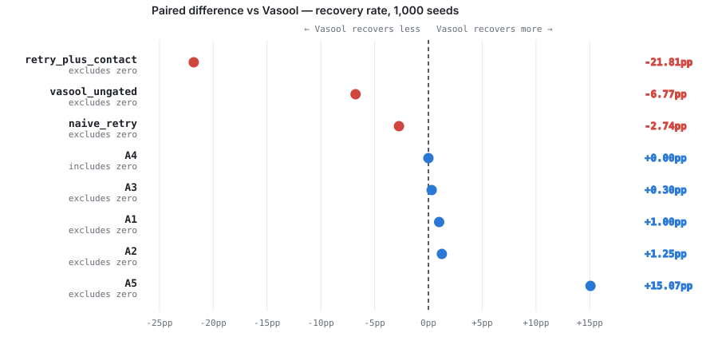
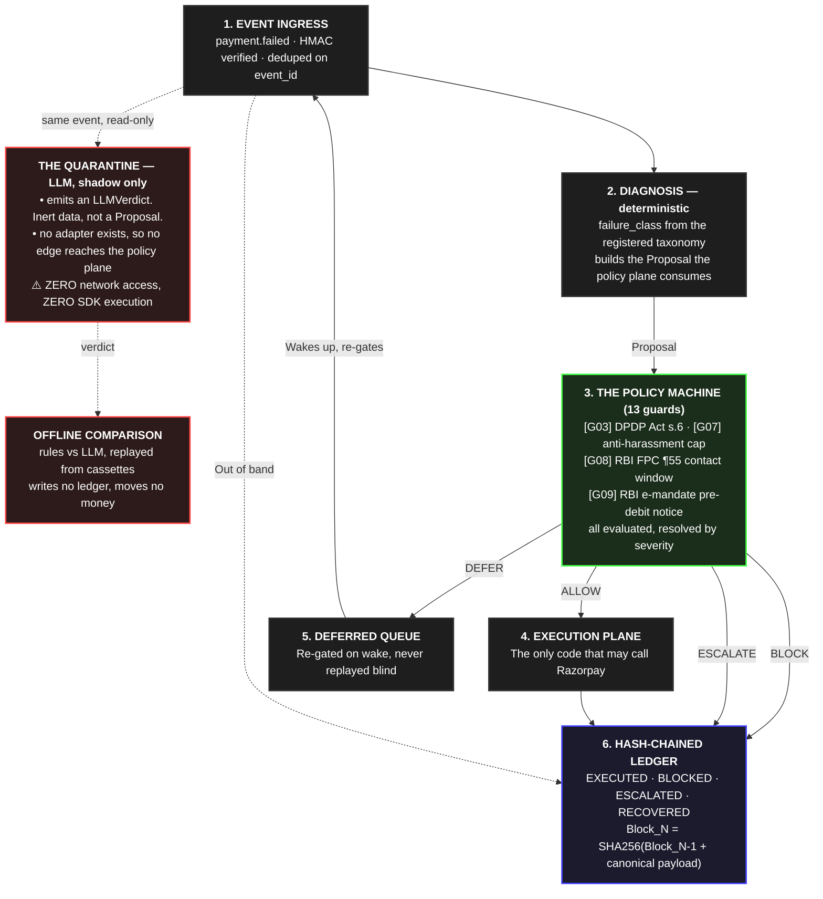

<div align="center">

<h1>⚖️ Vasool</h1>

<p>
  <strong>Recovers ₹116 Cr of failed payments with zero compliance violations —<br/>
  and a hash-chained receipt for every rupee, including the ones it refused to chase.</strong>
  <br/><br/>
  <em>The LLM never touches money: it has no tools, and emits a type nothing can execute.<br/>
  A deterministic state machine decides. Thirteen guards gate every rupee.</em>
</p>

<p>
  <a href="#the-result"></a>
  <a href="#the-result"></a>
  <a href="#the-holdout-agrees"></a>
  <a href="#and-now-the-uncomfortable-part"></a>
  <a href="#f1f7--the-criteria-that-could-have-killed-this"></a>
  <a href="https://razorpay.com/buildathon/"></a>
</p>

<p>
  <sub>
    <a href="#the-problem"><b>The problem</b></a> &nbsp;·&nbsp;
    <a href="#the-result"><b>The result</b></a> &nbsp;·&nbsp;
    <a href="#and-now-the-uncomfortable-part"><b>Where it loses</b></a> &nbsp;·&nbsp;
    <a href="#verify-it-yourself"><b>Verify it yourself</b></a> &nbsp;·&nbsp;
    <a href="#the-air-gap"><b>The air gap</b></a> &nbsp;·&nbsp;
    <a href="#f1f7--the-criteria-that-could-have-killed-this"><b>F1–F7</b></a> &nbsp;·&nbsp;
    <a href="#what-broke"><b>What broke</b></a>
  </sub>
</p>

> 📊 **[Live dashboard →](https://sriramvarun0636.github.io/Vasool)** · every figure below is rendered from [`out/development/evaluation.json`](out/development/evaluation.json), which **ships in this repo** — open it and check any number here without running anything.<br/>
> 🔧 **[Six incidents, in full →](POSTMORTEM.md)** · four of them cases where the system was silent about being wrong and an artifact caught it.

<a href="https://sriramvarun0636.github.io/Vasool">
  
</a>

<sub><i>Nine exhibits, every figure traced to a manifest key &mdash;
<a href="https://sriramvarun0636.github.io/Vasool">open the live version</a>.</i></sub>

<h3>A dumber baseline beats it by 16 percentage points.</h3>

<p>
  It also breaks policy in <b>1,000 of 1,000</b> seeded worlds. Vasool breaks it in <b>none</b>.<br/>
  That trade is the entire submission. It was registered as falsification criterion <b>F1</b><br/>
  before the first run, and it is reported <a href="#and-now-the-uncomfortable-part">two sections down</a> &mdash; not in an appendix.
</p>

</div>

---

## The problem

Payment failures don't fail in one clean way, and treating them as one problem is what loses the money. **An expired card and a gateway blip arrive as the same webhook and need opposite responses.** Retrying the expired card has exactly zero chance of working, and it burns one of the four attempts Razorpay allows before it halts the subscription — the attempt a re-auth link needed.

So the agent classifies before it acts: five failure classes, each with a registered intervention and a registered attempt budget. Then thirteen guards decide whether the chosen action may actually happen, and the ledger records the answer either way.

---

## The result

Across 1,000 seeded universes of 500 customers each, Vasool detected revenue at risk, diagnosed each failure, chose an intervention, and executed a bounded recovery workflow:

| | Development set (40%) | Holdout (60%, sealed) | Total |
| :--- | ---: | ---: | ---: |
| **Money recovered** | **₹46.50 Cr** | **₹69.60 Cr** | **₹116.09 Cr** |
| Episodes recovered | 49.07% | 48.92% | — |
| **§2a safety predicate held** | **1,000 / 1,000 seeds** | **1,000 / 1,000 seeds** | — |
| Automated actions on risk-declined payments | **0** | **0** | — |

The component figures are rounded to two decimals; **the total is the sum of the underlying paise, not of the rounded numbers** — which is why it reads 116.09 rather than 116.10. Every rupee in that column is summed from hash-chained receipts, not from the simulator's own bookkeeping — the two records are compared and every disagreement is reported rather than reconciled away.

### And now the uncomfortable part

**A dumber agent recovers more.** The realistic incumbent — retry everything, then send a link — recovers **65.4%** to Vasool's 49.1%: a paired difference of **−16.35 percentage points**, interval [−16.54, −16.17], nowhere near zero.

That was registered as falsification criterion **F1** in [`docs/EVALUATION.md`](docs/EVALUATION.md) before the first run, along with the rule that a criterion which fires gets said out loud. So here it is, second paragraph, not an appendix.

Here is what the incumbent does to earn those extra 16 points:

| | `retry_plus_contact` (incumbent) | ⚖️ **Vasool** |
| :--- | ---: | ---: |
| Recovery rate | **65.42%** | 49.07% |
| Seeds where the §2a safety predicate held | **0 / 1,000** | **1,000 / 1,000** |
| Automated actions on risk-declined payments | 20,988 | **0** |
| Retries burned on a dead instrument | 292,256 | 64,321 |
| Retries on a class the taxonomy prices at zero attempts | 66,040 | **0** |

The incumbent is not a worse agent that happens to score higher. It is an agent that **cannot legally be deployed**, scoring higher *because* of the actions that make it undeployable. Every one of those columns is a ledger scan, reproducible from a seed — not a self-report.

**The honest one-line summary:** the taxonomy did not buy recovery. It bought a deployable system, and the 16 points are what that cost in this simulator.

<picture>
  <source media="(prefers-color-scheme: dark)" srcset="docs/assets/forest-dark.svg">
  
</picture>

Every arm runs the **same seeded universe** — same customers, same arrivals, same outcome draws — so the comparison is the per-seed difference, bootstrapped over 1,000 seeds. At this sample size every interval is narrower than its own marker (the widest spans 0.37pp), so the dots *are* the intervals. Regenerate the plot with `python3 tools/make_forest_svg.py`; it reads the same manifest the dashboard does, so the two cannot disagree.

### The holdout agrees

60% of customers were sealed before any tuning began, and §3c registers that they are evaluated **exactly once**. That once has now happened:

| | Holdout (sealed 60%) | Development (40%) |
| :--- | ---: | ---: |
| Vasool recovery | **48.92%** | 49.07% |
| Incumbent recovery | **65.24%** | 65.42% |
| F1 paired difference | **−16.311pp** [−16.454, −16.166] | −16.353pp [−16.540, −16.166] |
| F5 gap (threshold 20pp) | **4.719pp** | 4.742pp |
| §2a predicate, Vasool | **1,000 / 1,000** | 1,000 / 1,000 |
| §2a predicate, incumbent | **0 / 1,000** | 0 / 1,000 |
| F1–F5 | **none fired** | none fired |

No arm moved more than 0.19pp. Every conclusion replicates in sign, magnitude and verdict.

**What that does and doesn't prove.** It does not validate the outcome model — both cohorts come from the same registered universe, so a wrong parameter is wrong in both. What it rules out is the thing §3c was written against: tuning thresholds against visible numbers until the result appears. A taxonomy fitted to the development set would not reproduce its own effect sizes to within two hundredths of a point on customers it had never been measured on.

Recorded in [`docs/EVALUATION.md` §10](docs/EVALUATION.md) under 2026-08-29, with the two limits on it stated — F6 is not evaluated on the holdout, and F7 reports `null` there because that run predates the amendment that wired it. **The holdout was not re-run to fix that**, because a second execution is exactly what §3c forbids.

### What the gap bought

- **1,000 / 1,000 seeds** satisfy the [§2a safety predicate](docs/EVALUATION.md) — eight ledger-scanned claims covering contact windows, DLT templates, risk blocks, consent withdrawal, dead-instrument retries, contact caps, hash-chain integrity and receipt uniqueness.
- **pass^k = 1.0** at every registered k ∈ {1, 5, 10, 25, 50, 100}. A system safe in 99 of 100 worlds is not safe; `pass^k` is what makes an intermittent violation visible where a mean would bury it.
- **4.7 percentage points** is the measured price of the guard chain — `vasool_ungated` (identical taxonomy, no guards) recovers 53.8%. F5 was registered at a 20-point threshold. It did not fire.
- **Byte-identical ledgers** on re-run. Same seed → same SHA-256 chain, asserted by [`tests/test_replay.py`](tests/test_replay.py) for one episode and [`tests/windtunnel/test_runner.py`](tests/windtunnel/test_runner.py) for a whole 500-customer run, and recomputed as `determinism.identical` in the manifest.

---

## Verify it yourself

Nothing here asks for trust. The whole artifact regenerates from source:

```bash
git clone https://github.com/sriramvarun0636/Vasool && cd Vasool
python -m venv .venv && source .venv/bin/activate
pip install -r requirements.txt
cp .env.example .env          # then set VASOOL_ID_PEPPER to any string

pytest                        # 1,387 tests
make demo                     # one episode, narrated, no network
make redteam                  # 22 adversarial attacks -> out/adversary/redteam.json
make eval                     # 9 arms x 1,000 seeds  (~20 min)
make report                   # builds out/report.html from the manifest
PARTIAL=1 make shadow         # rules vs LLM, replayed from committed cassettes -- no network
make replay                   # points at where determinism is asserted (make eval + tests)
```

Nothing above needs a key or a network. `make demo` and `make shadow` replay by
default — `LIVE=1` and `RECORD=1` are the only ways to reach Razorpay or a model
provider, and without them a missing recording is a hard failure rather than a
silent live call. `PARTIAL=1` is there because the recorded corpus is
incomplete: it replays the cells that exist, renders the rest as `—`, and
writes to `classifier_comparison_partial.*` so a partial run can never
impersonate a full one.

`make sweeps` runs the full §7 sensitivity grid — 83 configurations × 9 arms × 200 seeds. It takes about nine hours and resumes if interrupted.

> ⚠️ `make eval` **overwrites the committed manifest** with a base-protocol-only
> run. The values reproduce, but the `sweeps` block and F6's verdict do not
> exist in it — only `make sweeps` writes those — so the dashboard's sensitivity
> grid would render as dashes afterwards. `git checkout out/` puts the shipped
> one back.

### Every claim, and where it comes from

No figure in this README is typed by hand. Each one is a key in [`out/development/evaluation.json`](out/development/evaluation.json), the manifest `make sweeps` writes — **committed, so you can check the right-hand column yourself in about ten seconds**:

| Claim in this README | Manifest key | Value |
| :--- | :--- | ---: |
| Vasool recovers 49.07% | `per_arm.vasool.recovery_rate_mean` | `0.4906981214797104` |
| Incumbent recovers 65.42% | `per_arm.retry_plus_contact.recovery_rate_mean` | `0.6542272536430769` |
| Ungated recovers 53.81% | `per_arm.vasool_ungated.recovery_rate_mean` | `0.5381228185488008` |
| −16.35pp, interval excludes zero | `paired_vs_vasool.retry_plus_contact.recovery_rate` | `point: -0.163529…` |
| Safety predicate on 1,000/1,000 | `per_arm.vasool.safety_holds_on` | `1000` |
| pass^100 = 1.0 | `pass_k.100` | `1.0` |
| 20,988 actions on risk-declined | `per_arm.retry_plus_contact.risk_block_actions_world` | `20988` |
| 66,040 retries on a zero-budget class | `per_arm.retry_plus_contact.customer_action_retries_world` | `66040` |
| F5 gap 4.74pp of a 20pp threshold | `falsification.F5_compliance_unaffordable.gap_pp` | `4.742469…` |
| Ledgers byte-identical on re-run | `determinism.identical` | `true` |
| 18 of 22 attacks survive | `out/adversary/redteam.json` → `survived` | `18` |

The dashboard makes this checkable without leaving the page: **click _trace every number_ and every figure on it displays the exact manifest key it was read from** — the button reports how many, so the count is never a number this README can get wrong. A value the manifest does not carry renders as a dash and raises a warning banner — never as a plausible number.

That rule is enforced, not merely stated. [`tests/test_report.py`](tests/test_report.py) fails the build if a `|| <number>` fallback is reintroduced on any expression reading from the manifest. It exists because one was found in this repository, rendering a hardcoded constant as a measurement; the incident is recorded in [`docs/EVALUATION.md` §10](docs/EVALUATION.md).

### Check the cryptography without trusting us

The manifest ships twelve real receipts from seed 0, each with the exact byte string its hash was computed over:

```bash
python3 - <<'EOF'
import json, hashlib
d = json.load(open("out/development/evaluation.json"))
rs = d["determinism"]["sample_receipts"]
print("hash == sha256(payload):", all(
    hashlib.sha256(r["canonical_payload"].encode()).hexdigest() == r["hash"] for r in rs))
print("chain links:", all(b["prev_hash"] == a["hash"] for a, b in zip(rs, rs[1:])))
EOF
# hash == sha256(payload): True
# chain links: True
```

Exhibit H on the dashboard does the same computation in your browser with the Web Crypto API.

---

## What the agent actually does

Real output from `make demo`, pinned byte-for-byte by [`tests/test_demo.py`](tests/test_demo.py) against [`data/golden/`](data/golden/). An expired card fails at 19:30 IST — inside the RBI Fair Practices Code's prohibited contact window:

```text
[4] classified
    failure_class: INSTRUMENT_DEAD
    rationale    : Zero percent chance of succeeding — not low, zero. There is
                   no state of the world in which the same expired card
                   authorises on the third attempt. A retry has exactly zero
                   expected value while consuming one of the four attempts the
                   re-auth link needed.

[6] guard chain -- cycle 1 (2026-08-21 19:30 IST)
    IdempotencyGuard    ALLOW
    RiskBlockGuard      NOT_APPLICABLE
    ConsentGuard        ALLOW              DPDP Act 2023 s.6 + DPDP Rules 2025
    RetryCapGuard       NOT_APPLICABLE
    PromiseToPayGuard   ALLOW              RBI FPC (fair dealing)
    DNDGuard            NOT_APPLICABLE
    FrequencyCapGuard   ALLOW              RBI FPC (anti-harassment)
    ContactWindowGuard  DEFER -> 2026-08-22 08:09 IST
                                           RBI FPC ¶55 — 19:30 IST is outside
                                           the 08:00-19:00 contact window
    ...
[7] decision -- cycle 1
    resolved     : DEFER -> 2026-08-22 08:09 IST
```

Three things are load-bearing here and none of them are the LLM:

1. **All thirteen guards run, then resolve by severity.** Not short-circuit. A cheapest-first chain would have stopped at the first refusal and the receipt would cite one clause instead of every violated one.
2. **Gating happens at execute time, not propose time.** The proposal was built at 19:30 and gated again when it woke at 08:09 — because consent can be withdrawn, and the payment can settle, in between.
3. **08:09, not 08:00.** The deferral target carries a per-customer offset derived from `sha256(customer_id)` — deterministic, so the ledger still replays byte-identically, but enough to stop a merchant's whole overnight backlog firing at 08:00:00.000. A burst of simultaneous messages reads to a recipient exactly like the automated dunning ¶55 exists to prevent.

---

## The air gap

The LLM has no tools. It cannot reach the Razorpay SDK, and there is no code path that converts what it emits into something executable — the diagnosis plane returns an `LLMVerdict`, and `LLMVerdict` is deliberately **not** a `Proposal`. There is no adapter. Invariant 1 is a property of the type graph, and [`tests/test_shadow_boundary.py`](tests/test_shadow_boundary.py) walks the import graph in both directions to prove it.



**Restraint is recorded as loudly as action.** A `BLOCKED` receipt is a first-class entry in the same chain as an `EXECUTED` one, carrying every clause that refused it. An agent that quietly does nothing and an agent that correctly declines are indistinguishable unless the ledger says which happened.

### Four of the thirteen guards

| Guard | Citation | Trigger | Response |
| :--- | :--- | :--- | :--- |
| **G03** `ConsentGuard` | DPDP Act 2023 s.6 | consent absent or withdrawn | `BLOCK`, and purge queued work for that customer |
| **G07** `FrequencyCapGuard` | RBI FPC (anti-harassment) | >2 contacts/episode, or >3 per customer per rolling 7d | `BLOCK` |
| **G08** `ContactWindowGuard` | RBI FPC ¶55 | dispatch time outside 08:00–19:00 IST | `DEFER` to the next open window |
| **G09** `PreDebitNoticeGuard` | RBI e-mandate framework | mandate debit with no notice served | `DEFER`, and emit the obligation to send one |

---

## The LLM, measured

The air gap is an architectural claim. This is the empirical one: on the cells recorded so far, the LLM classifier gets the **failure class** right **57.6%** of the time, and picks the **action** §4 names for the row **33.3%** of the time.

The rules classifier scores 1.000 — **by construction, not by measurement.** Ground truth resolves through the same lookup the rules read, and the rendered artifact says so in its own header rather than letting you assume otherwise.

That gap is the argument for where the LLM sits. A component that picks the right action a third of the time is not one you put in front of a payment; it is one you run in shadow, compare, and keep behind a state machine.

**This comparison is incomplete and the artifact refuses to pretend otherwise.** It is written as `classifier_comparison_partial.json` — the `_partial` suffix is enforced so it cannot overwrite or be mistaken for a full run:

```
coverage: 3 of 12 cells, 41 of 180 classifications recorded
    payment_failed / gateway              15/15
    insufficient_fund / bank              15/15
  ~ card_declined / bank                  11/15
  ! gateway_technical_error / gateway      0/15
  ! …and eight more cells at 0/15
```

Two depths, and they cost very differently. **Breadth** — every cell answered once — needs **9 more classifications**, one day of Gemini's 20-request free tier, and yields a complete comparison the tool will write without the `_partial` suffix. **Depth** — the registered 15 repeats per cell, which is what makes consistency measurable across the corpus rather than on three cells — needs 139 more, about a week of quota.

Every rate above is computed over recorded cells only; an unrecorded cell contributes to no numerator and no denominator. Reproduce with `PARTIAL=1 make shadow` (replay, no network — bare `make shadow` exits 3 rather than quietly filling a gap), or resume recording at the first missing cell:

```bash
RECORD=1 REPEATS=1 make shadow   # 9 requests -> complete at k=1
RECORD=1 make shadow             # 139 requests -> full depth, resumes across days
```

## F1–F7 — the criteria that could have killed this

Registered in [`docs/EVALUATION.md` §9](docs/EVALUATION.md) before any run, with thresholds, because a criterion invented after seeing the numbers is not a criterion.

| | Criterion | Threshold | Result |
| :--- | :--- | :--- | :--- |
| **F1** | The taxonomy adds nothing | interval vs `retry_plus_contact` includes zero | did not fire — but **excludes zero on the wrong side**, −16.35pp. Read as *worse* than F1 firing. |
| **F2** | The flagship `card_expired` claim is inert | A3 inert on recovery **and** attempts | did not fire — attempts-per-recovery −0.151 |
| **F3** | Salary-aware timing is noise | A2 interval includes zero | did not fire — +4.98pp |
| **F4** | The guards are unreliable | pass^100 < 1.0 | did not fire — pass^100 = 1.0 |
| **F5** | Compliance is unaffordable | ungated beats gated by >20pp | did not fire — 4.74pp |
| **F6** | The conclusions are model artifacts | ≥5 of 8 comparisons flip across the 83-config grid | did not fire |
| **F7** | Determinism fails | two runs of one seed differ | did not fire — ledgers identical |

**F1's `fired: false` is not good news and the artifact says so in its own `detail` field.** F1 as registered fires when the interval *includes* zero. Ours excludes zero — in the baseline's favour. The criterion is silent on that case, which is exactly why the manifest carries a `direction` field beside it.

---

## What broke

### The defect that 1,353 passing tests could not see

Every test passed. The safety predicate was clean on 1,000 seeds. No guard misbehaved, no receipt was missing, no exception was raised — and a third of the population was doing nothing at all.

`PreDebitNoticeGuard` holds a mandate debit until a 24-hour notice has been served, and returns an *obligation* to send one. Obligations were honoured only on the **execute** path. A deferred proposal does not execute — so no notice was ever built, so the timestamp stayed empty, so the guard deferred again, five times, and then blocked it for good. **The one thing that could satisfy the guard was an execution the guard was blocking.**

I found it writing an adversarial attack that turned out to be inert: it could not fail, because the thing it attacked never happened.

| Seed 0, full universe | before | after |
| :--- | ---: | ---: |
| Pre-debit notices executed | 0 | **196** |
| Retries executed | 707 | **979** |
| …of them landing on a mandate episode | **0** | **272** |
| Mandate episodes ending `BLOCKED` | 209 / 275 | **30 / 275** |
| Headline recovery rate | 0.344341 | **0.490698** |
| F5 gap, against a 20pp threshold | 19.378 | **4.742** |

It had been shaping every number published before 2026-08-25. **Three quarters of what I had been calling "the price of the guards" was this bug** — and F5 had been sitting six tenths of a point from firing for a reason that had nothing to do with compliance.

Every test I had written asked whether the agent did something *wrong*. Not one asked whether it did anything *at all*. That is the lesson: liveness needs its own assertions, because a guard that defers forever is indistinguishable from a guard that works. The full before/after is [`docs/taxonomy.md` §9.13](docs/taxonomy.md); the re-run and the stale-shard incident it exposed are in [`docs/EVALUATION.md` §10](docs/EVALUATION.md).

### The adversary

We wrote a survival criterion, registered it, and only then wrote 22 attacks against it. [`windtunnel/adversary/criterion.py`](windtunnel/adversary/criterion.py)'s `judge()` is the only thing that can return a verdict, and it scans the ledger the way §2a scans — never "a guard returned BLOCKED".

**18 of 22 survive.** Four remain open, and they are the complete set:

| | Attack | Why it still wins |
| :--- | :--- | :--- |
| **A01** | Out-of-band payment mid-ladder | A customer who pays through another channel carries no join key. We keep chasing money the merchant already has — a double-collection hazard, not a lost-revenue one. |
| **A07** | One human, two customer IDs | Per-human contact caps key on a derived id; two ids for one person defeat the cap. Worst case seen: 4 contacts in 7 days against a cap of 3. |
| **A08** | Contact window in the wrong timezone | The window is enforced in merchant-local IST, not the customer's. One contact landed at 22:30 customer-local. |
| **A09** | Message to a DND-listed customer | `DNDGuard` scopes to promotional traffic; the classification gap lets one through. |

Each of these is written up properly in [`POSTMORTEM.md`](POSTMORTEM.md), alongside the bugs that were found and fixed.

Four attacks — A15, A16, A18, A19 — **were** open and are now closed. A queued proposal used to outlive the diagnosis that built it, so a retry minted from a benign row could fire on a payment that had since been risk-declined. `PolicyMachine.observe()` now retires superseded work. The full account, including the four demonstrations, is [`docs/taxonomy.md` §9.12](docs/taxonomy.md).

`make redteam` reproduces all of it.

---

## What this evaluation will not claim

The single most important section, and it is [in the protocol](docs/EVALUATION.md) rather than here:

- **Not** that Vasool would recover 49% of *your* failed payments. It measures a model, and the model is mine.
- **Eight of the nine outcome parameters are `[guess]`** — my judgement, tagged as such in the simulator's own source, where a parameter with no provenance tag fails a test. Nobody publishes conditional retry-success probabilities at this granularity, and inventing a citation would have been the first dishonest sentence in the repository.
- **Nine of ten error reasons are `_SIMULATED`.** Razorpay test mode reproduces exactly one failure reason — `payment_failed` — regardless of which documented "error scenario" card you use. That finding, and everything else learned live, is in [`docs/VERIFIED.md`](docs/VERIFIED.md).
- **Subscriptions were unavailable pre-activation**, so the failed-mandate loop is stub-only.
- **The LLM comparison covers 3 of 12 cells** — 41 of 180 classifications. Free-tier quota, not a design choice, and the artifact carries the `_partial` suffix so it cannot be read as a full run. Nine more classifications complete it at k=1.
- **The `[guess]` fraction is itself a headline result** and appears on the dashboard as prominently as the recovery rate.

Every amendment to the protocol after registration — thirty-four of them — is logged in §10 with a date, a reason, and a **POST-HOC** flag stating whether it was made with the relevant output already visible. Two rows were re-marked `No → Yes` when the standard was tightened retroactively, including one that had been disclosing honestly before there was a rule requiring it to.

---

## Repository map

| Path | What lives there |
| :--- | :--- |
| [`POSTMORTEM.md`](POSTMORTEM.md) | **Six incidents, in detail.** Four of them are cases where the system was silent about being wrong and an artifact caught it. Start here. |
| [`ARCHITECTURE.md`](ARCHITECTURE.md) | The five planes, the air gap as a property of the type graph, the five invariants, and the named structural debt |
| [`COMPLIANCE.md`](COMPLIANCE.md) | All thirteen guards, what each rests on, and the 34 places the code flags its own uncertainty |
| [`vasool/diagnosis/`](vasool/diagnosis/) | The failure taxonomy, the deterministic classifier, and the LLM shadow (which never touches a ledger) |
| [`vasool/policy/`](vasool/policy/) | Thirteen pure-function guards, the state machine, the transition log |
| [`vasool/actions/`](vasool/actions/) | The only code permitted to call Razorpay |
| [`vasool/ledger/`](vasool/ledger/) | Hash-chained receipts and `verify_chain` |
| [`windtunnel/`](windtunnel/) | The simulator, the outcome model, the evaluator, and the adversary |
| [`docs/EVALUATION.md`](docs/EVALUATION.md) | The pre-registered protocol. Append-only. |
| [`docs/taxonomy.md`](docs/taxonomy.md) | Why each failure class gets the intervention it gets, and §9's known limits |
| [`docs/VERIFIED.md`](docs/VERIFIED.md) | Everything learned from the live account, including what did not work |

---

<div align="center">
<sub>Built for the Razorpay AI Buildathon, Track 03.<br/>
A figure not derivable from the protocol is not a result — including ours.</sub>
</div>
