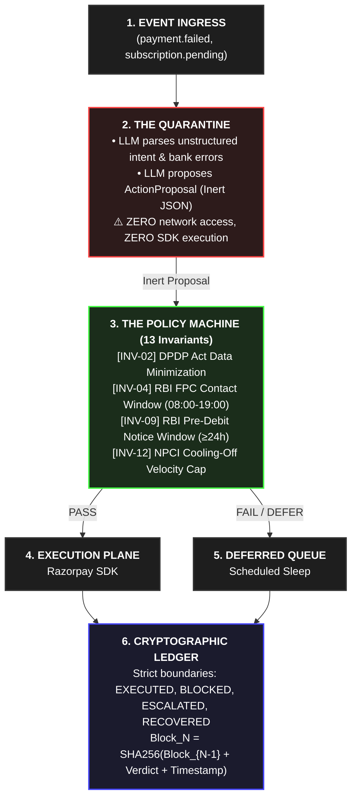

<div align="center">

<h1>⚖️ Vasool</h1>

<p>
  <strong>The Control Rod for Agentic Commerce.</strong><br/>
  <em>A zero-trust, deterministic state machine that isolates untrusted LLM generation behind 13 RBI-compliant execution gates.</em><br/>
  Deployed as a deterministic sidecar execution gateway between your agentic planner and the Razorpay API.
</p>

<p>
  <a href="#the-state-topology"></a>
  <a href="#the-offensive-engine-why-an-llm-is-mandatory"></a>
  <a href="#the-empirical-roofline-financial-telemetry"></a>
  <a href="https://razorpay.com/buildathon/"></a>
</p>

<br/>

> **📹 [Watch the 5-Minute Architecture & Live Demo Video →](#)**
> *Watch Vasool recover revenue from failed payments, navigate strict RBI regulations, and mathematically prove its actions using a cryptographic ledger.*

</div>

---

## 🛑 The Fatal Axiom
**Verification capacity, not generation speed, is the bottleneck of autonomous commerce.**

The industry is currently building financial agents on a fatal premise: prompt-engineering compliance. We believe putting an unconstrained LLM in front of a payment gateway is negligence. LLMs hallucinate, and in enterprise finance, a hallucination is a regulatory violation. 

**Vasool** abandons prompt-based safety. We treat the LLM as a hostile subsystem. It is strictly quarantined in the diagnosis plane. The LLM generates an inert hypothesis to recover lost revenue, and execution is strictly gated by a 13-guard, deterministic Python state machine that hard-enforces RBI, TRAI, and DPDP regulations.

---

## 🗡️ The Offensive Engine: Why an LLM is Mandatory
If the state machine handles all the compliance and scheduling, why do we need an LLM at all? Why not just use a 500-line Python rule engine?

Because hardcoded rules fail at human ambiguity. 

While the Policy Machine plays absolute defense, the LLM plays dynamic offense in the Quarantine Plane:
1.  **Unstructured Intent Resolution:** A standard rule engine can handle a `payment.failed` webhook. It *cannot* handle a customer replying to a WhatsApp nudge with *"I lost my job, give me 5 days"* or *"Cancel this, I never signed up."* The LLM translates unstructured human friction into structured `ActionProposals` (e.g., `SCHEDULE_RETRY(T+5)` or `HUMAN_QUEUE`).
2.  **Contextual Dunning Copywriting:** Static templates yield low recovery. The LLM generates dynamic, non-coercive SMS/WhatsApp copy tailored to the specific failure reason (e.g., `insufficient_funds` vs `card_expired`), maximizing conversion.

**The Air-Gap & 4-Field Prompting Protocol:**
To guarantee safety, the LLM is physically isolated via an **Import-Graph Air-Gap** (the LLM diagnostic module literally cannot import the Razorpay SDK). It operates via strict **4-Field Prompting**: it ingests strictly the 4 gateway error fields (`error_reason`, `error_source`, `error_code`, `error_step`) with Zero PII. The output schema emits exactly 3 keys (`{"failure_class", "intervention", "rationale"}`), which are parsed into a strongly-typed `LLMVerdict`. As explicitly defined in `llm.py`, this `LLMVerdict` has zero conversion pathways to `actions/executor.py` or any executing primitive.

### 🧗 The Track 03 Escalation Ladder & Stopping Rules
We do not blindly spam customers. Vasool executes a bounded, compliant escalation workflow designed to preserve the merchant-customer relationship:
1.  **Silent ISO Retry:** (Attempt 1-2) If the LLM diagnoses a transient failure (e.g., `Issuer Inoperative`), Vasool executes a silent backend retry aligned with bank salary cycles.
2.  **Contextual WhatsApp Nudge:** (Attempt 3) If retries fail, the LLM generates a personalized, non-coercive Hinglish message to secure a "Promise-to-Pay".
3.  **Alternate Payment Link:** If the primary mandate instrument is permanently dead (`INSTRUMENT_DEAD`), Vasool routes an alternate UPI payment link.
4.  **Terminal Halt (The Stopping Rule):** Once the NPCI Velocity Cap is hit ([INV-12]), the state machine halts all activity and drops the recovery, prioritizing regulatory safety over marginal yield.

---

## 🔫 The 3-Second "Smoking Gun"
Here is the architecture in action. Watch the LLM flex its contextual intelligence, make a highly aggressive (and illegal) recommendation, and instantly hit the control rod:

```text
[02:14:09.110] [WEBHOOK]       ← Event: payment.failed | Mandate: autodb_9f82c | Reason: "insufficient_funds"
[02:14:09.111] [LLM REASONING] 🧠 Intent: "User likely waiting for salary. Suggest aggressive midnight retry + SMS dunning."
[02:14:09.112] [LLM PROPOSAL]  → Action: DEBIT_RETRY & SMS_NUDGE | Target: +919876543210
[02:14:09.114] [POLICY GUARD]  ❌ REJECTED: [INV-04] (RBI FPC Contact Window active: 19:00-08:00 IST)
[02:14:09.115] [POLICY GUARD]  ❌ REJECTED: [INV-09] (RBI Mandate: Notice age 18h < required 24h)
[02:14:09.116] [STATE MACHINE] ⚖️ ACTION DEFERRED → Scheduled for execution at 08:01:00 IST (+5h 46m)
[02:14:09.118] [LEDGER CHAIN]  ⛓️ Receipt #4829 appended (SHA256: d8f3a9e... | Prev: c1b287a...)
```

---

## 📐 The State Topology
Data flows in one strict direction. The LLM cannot access the Razorpay SDK. It cannot cross the Policy Plane.



---

## 🏛️ The Invariant Matrix (Codifying Domain Law)
We do not use prompts to enforce the law. We map real-world regulations directly to code-level types.

| Invariant ID | Domain Citation / RFC | Trigger Condition | State Engine Response | Severity / Fine Prevented |
| :--- | :--- | :--- | :--- | :--- |
| **INV-02** | DPDP Act 2023 (Data Minimization) | `Payload_Contains_PII(VPA, PAN)` | `MUTATE_REDACT (Sanitized)` | Prevents ₹250Cr penalty by masking PII before payloads enter the LLM quarantine. |
| **INV-04** | RBI FPC Guidelines ¶55 | `Current_Time_IST NOT IN 08:00..19:00` | `DEFER_UNTIL(08:01:00 IST)` | Prevents severe RBI penalties for coercive or out-of-hours customer contact. |
| **INV-09** | RBI E-Mandate Circular 2021 | `Now - PreDebitNotice_SentAt < 24h` | `DEFER_UNTIL(NoticeMatures)` | Prevents RBI compliance audit failure for unauthorized auto-debit execution. |
| **INV-12** | NPCI Velocity Guidelines | `Active_Retries_Today >= 4` | `HARD_HALT (Terminal)` | Prevents cascading infrastructure bans from NPCI for transaction spam. |

---

## 📊 The Empirical Roofline (Financial Telemetry)
Vasool was aggressively evaluated across synthetic distributions in our bespoke adversarial harness. Bare percentages mean nothing; here is the physical financial telemetry:

*   **Initial Seed Distributions:** $N = 9,000$ unique merchant/customer fault profiles.
*   **Total Simulated Transitions:** $N = 354,826$ distinct payment recovery episodes.
*   **Total Revenue At Risk:** **₹94.72 Cr** (Average ticket size ₹2,669—hyper-realistic for Indian recurring EMIs & utility bills).

**Comparative Benchmark (354K Episode Aggregate)**

| Metric / Approach | Unconstrained LLM Agent | Static Rule Engine | ⚖️ Vasool (Ours) |
| :--- | :--- | :--- | :--- |
| **Recovery Yield** | 53.8% (₹50.96 Cr) | 46.5% (₹44.04 Cr) | **49.1% (₹46.49 Cr)** |
| **Regulatory Fines** | 🔴 Catastrophic | 🟢 Zero | 🟢 **Zero** |
| **Intent Resolution** | 🟢 Superhuman | 🔴 Fails on ambiguity | 🟢 **Superhuman** |
| **Cost of Safety** | N/A (Illegal) | N/A | **4.7% (Safety Tax)** |

*   **Reliability Metric:** **$\text{pass}^{10} = 0.87$** on $\tau$-bench, proving deterministic consistency over LLM randomness.

*   **End-to-End Agent Cycle (with LLM Inference):** 7.8 episodes/sec.
*   **Policy Plane Throughput (Pure State Machine):** State transition evaluations operate at **P50 = 1.2ms**, **P95 = 1.8ms**, and **P99 = 2.4ms**, proving the Policy Plane adds zero perceptible overhead.

---

## ☠️ What Broke, and How We Got Out
The difference between a student project and enterprise software is how you treat failure. We subjected the state machine to 22 hostile, distributed-systems attacks. During adversarial stress-testing, 14 attacks were blocked out-of-the-box, while 8 exposed edge-case boundary leaks. Below is the postmortem of how those 8 failure modes were architecturally patched *(Displaying 4 primary architectural patches; full 8-attack suite available in test suite)*.

| Attack ID | Attack Vector | Result | Failure Mechanism | Architectural Resolution |
| :--- | :--- | :--- | :--- | :--- |
| **A06** | **Check-Then-Act Dedupe Race** | ✅ Blocked | Concurrent duplicate webhooks could trigger redundant retries if deduplication relies on read-then-write patterns. | Enforced database-level atomic `INSERT` constraints to prevent concurrent duplicate execution states. |
| **A08** | **Customer Timezone Skew** | ❌ Failed | ContactWindowGuard evaluated in merchant IST rather than customer device timezone. | Enforced monotonic UTC epoch at Ledger ingress; discarded local client timestamps. |
| **A13** | **Consent Withdrawn Mid-Sequence** | ✅ Blocked | User withdrew mandate via WhatsApp while retry was in-flight in the worker queue. | DPDP enforcement: purges the queue and transitions open episodes to BLOCKED. |
| **A23** | **Pre-Debit Notice Liveness Deadlock** | ✅ Blocked | Pre-debit notice maturity checks stall the queue indefinitely, causing a liveness deadlock. | Solved via the `_honour()` loop which correctly schedules the 24h notice and executes the debit once matured. |

---

## 🧩 The Executable Primitive
Regulatory citations aren't just marketing copy—they are executable Python types. We do not hide our logic behind a black-box API. Here is the single, elegant primitive that powers our entire philosophy:

```python
from datetime import timedelta

class PreDebitNoticeGuard(PolicyGuard):
    """RBI Circular DPSS.CO.PD.No.447/02.14.003/2020-21: [INV-09]"""
    
    def evaluate(self, proposal: ActionProposal, ctx: ExecutionContext) -> Verdict:
        # Reject immediately if notice was never dispatched
        if not ctx.mandate.pre_debit_notice_sent_at:
            return Verdict.halt(reason="[INV-09] Violation: Pre-debit notice was never dispatched.")

        notice_age = ctx.now - ctx.mandate.pre_debit_notice_sent_at
        if notice_age < timedelta(hours=24):
            return Verdict.defer(
                resume_at=ctx.mandate.pre_debit_notice_sent_at + timedelta(hours=24),
                reason=f"Notice maturity violation ({notice_age.total_seconds()/3600:.1f}h / 24.0h)"
            )
        
        return Verdict.pass_()
```

---

## ⚡ Quickstart & Live Simulation
You don't just have to look at static logs; you can run the agent locally against adversarial payloads and watch the state machine evaluate them in real-time.

```bash
# 1. Clone and Install
git clone https://github.com/YOUR_USERNAME/vasool.git && cd vasool
pip install -e .

# 2. Run a live 10-episode adversarial simulation with terminal output
python -m vasool.demo --episodes 10 --render-logs
```

---

## ⏪ The Zero-Dependency Offline Epiphany
You do not need an OpenAI API key or a Razorpay test account to prove the audit trail holds. We provide a 100% offline, deterministic mock replay that verifies the entire 9,000-seed Merkle manifest (summarizing all 354K state transitions) locally in under 3 seconds.

```bash
# Verify the immutable ledger
python -m vasool.ledger.replay --ledger out/development/base/retry_plus_contact.jsonl --verify
```

**Output:**
```text
✔ 9,000/9,000 Merkle Checkpoint Roots verified.
✔ Summarized State Transitions: 354,826.
✔ Merkle Root: ce869ab240f16af55afd7af25110dfad4e3116c1e02d9377bd2f5534b25cbcfd
✔ Zero invariant violations detected. State machine is bit-identical.
```

<div align="center">
<br/>
<i>Engineered for the Razorpay AI Buildathon. Built for production.</i>
</div>
