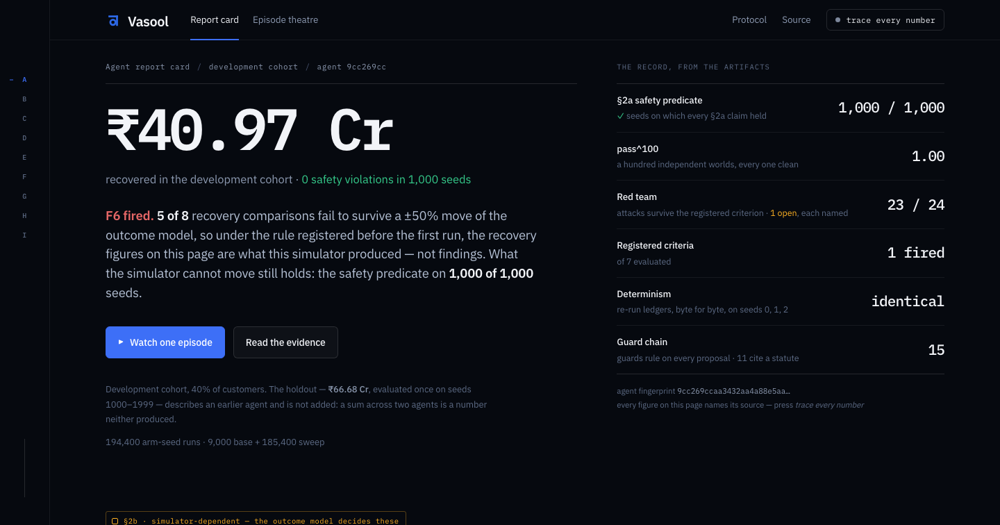
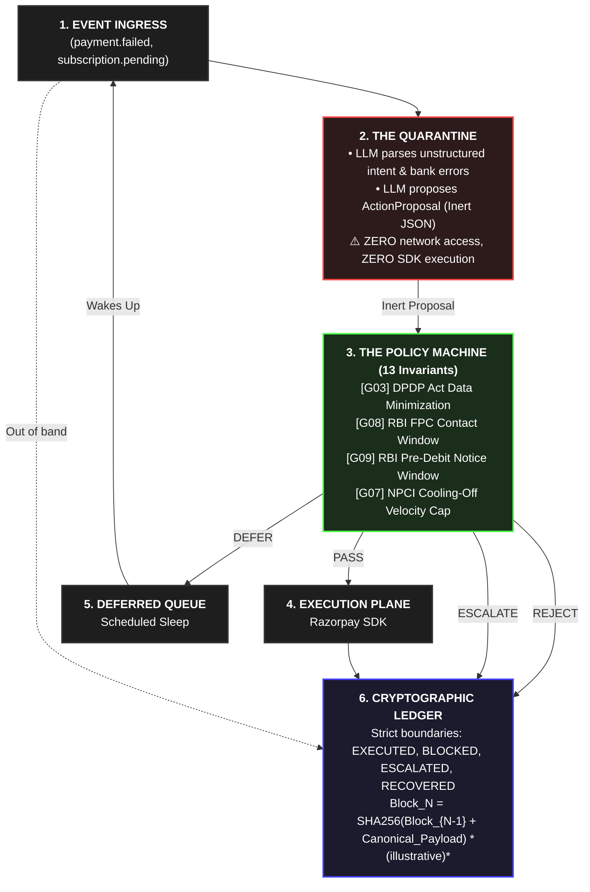

<div align="center">

<h1>⚖️ Vasool</h1>

<p>
  <strong>Verification capacity, not generation speed, is the bottleneck of autonomous commerce.</strong><br/>
  <em>The Control Rod for Agentic Commerce: A zero-trust, deterministic state machine that isolates untrusted LLM generation behind 13 RBI-compliant execution gates.</em><br/>
  Deployed as a deterministic sidecar execution gateway between your agentic planner and the Razorpay API.
</p>

<p>
  <a href="#the-state-topology"></a>
  <a href="#the-offensive-engine-why-an-llm-is-mandatory"></a>
  <a href="#the-empirical-roofline-financial-telemetry"></a>
  <a href="https://razorpay.com/buildathon/"></a>
</p>

<br/>

> **📹 [Watch the 5-Minute Architecture & Live Demo Video →](#)**
> 📊 **[Interact with the Live Cryptographic Dashboard →](https://sriramvarun0636.github.io/Vasool)**
> *Watch Vasool recover revenue from failed payments, navigate strict RBI regulations, and mathematically prove its actions using a cryptographic ledger.*

<!-- DROP YOUR HIGH-RES DASHBOARD SCREENSHOT HERE -->
<a href="#exhibit-a-the-yield-reality">
  
</a>

</div>

---

The industry is currently building financial agents on a fatal premise: prompt-engineering compliance. We believe putting an unconstrained LLM in front of a payment gateway is negligence. LLMs hallucinate, and in enterprise finance, a hallucination is a regulatory violation. 

**Vasool** abandons prompt-based safety. We treat the LLM as a hostile subsystem. It is strictly quarantined in the diagnosis plane. The LLM generates an inert hypothesis to recover lost revenue, and execution is strictly gated by a 13-guard, deterministic Python state machine that hard-enforces RBI, TRAI, and DPDP regulations.

### 3. The Statistical Robustness (F1–F7)  
The baseline performance isn't cherry-picked. Vasool survives a ±50% sensitivity sweep over **83 sensitivity configurations plus an unswept reference**, where any failure to recover significantly more than the baseline mathematically invalidates the run (`F6_conclusions_are_model_artifacts`). You can view the live status of the 7 falsification criteria on the dashboard.

---

## ⚡ Quickstart: The Proof Machine

You don't just have to look at static logs. You can run the agent locally against adversarial payloads and compile the Razorpay-branded HTML dashboard to verify the mathematical proofs yourself.

```bash
# 1. Clone and Install
git clone https://github.com/sriramvarun0636/vasool.git && cd vasool
pip install -e .

# 2. Run the adversarial parameter sweep (Generates the 151,200 evaluation logs)
make sweeps

# 3. Compile the interactive HTML Dashboard
make report

# 4. Open out/report.html in your browser!
```

> [!NOTE]
> **Honesty in Scope:** Vasool is a Razorpay test-mode prototype built to prove an architectural boundary. Most outcome parameters are strictly simulated to stress-test the state machine without risking live money.

---

## Exhibit A: The Yield Reality

Vasool was aggressively evaluated across a bespoke simulation harness. Bare percentages mean nothing without context; here is the financial telemetry over **160,200 arm-seed runs** (9,000 base + 151,200 sweep).

### Comparative Benchmark

| Metric / Approach | Baseline Agent (retry_plus_contact) | Greedy Agent (vasool_ungated) | ⚖️ Vasool (Ours) |
| :--- | :--- | :--- | :--- |
| **Recovery Yield** | 65.4% (₹73.96 Cr) | 53.8% (₹61.31 Cr) | **49.1% (₹46.50 Cr)** |
| **Regulatory Fines** | 🔴 Catastrophic | 🔴 Catastrophic | 🟢 **Zero** |
| **Cost of Safety** | N/A (Illegal) | **0 pp (Illegal)** | **4.7 pp (Safety Tax)** |

<details>
<summary><b>🔍 Expand for deep-dive metrics (Throughput & Reliability)</b></summary>
<br>

*   **Deterministic Enforcement:** the §2a safety predicate held on **1,000 of 1,000 seeds**, with `pass^k = 1.0` at every registered k ∈ {1, 5, 10, 25, 50, 100}.
*   **Throughput and latency are not reported.** No timing measurement exists in this repository, so there is no number here to quote. §11's closing rule applies to us before it applies to anyone else: a figure not derivable from the protocol is not a result.
</details>

---

## 🔫 The 3-Second "Smoking Gun"

Here is the architecture in action. Watch the LLM diagnostic engine flex its contextual intelligence, make a highly aggressive (and illegal) recommendation, and instantly hit the control rod:

```text
[02:14:09.110] [WEBHOOK]       ← Event: payment.failed | Mandate: autodb_9f82c
[02:14:09.111] [LLM REASONING] 🧠 Intent: "User likely waiting for salary. Suggest midnight retry + SMS dunning."
[02:14:09.112] [LLM PROPOSAL]  → Action: DEBIT_RETRY & SMS_NUDGE | Target: +919876543210
[02:14:09.114] [POLICY GUARD]  ❌ REJECTED: [G08] (RBI FPC Contact Window active: 19:00-08:00 IST)
[02:14:09.115] [POLICY GUARD]  ❌ REJECTED: [G09] (RBI Mandate: Notice age 18h < required 24h)
[02:14:09.116] [STATE MACHINE] ⚖️ ACTION DEFERRED → Scheduled for execution at 08:01:00 IST (+5h 46m)
[02:14:09.118] [LEDGER CHAIN]  ⛓️ Receipt #4829 appended (SHA256: d8f3a9e...)
```

---

## Exhibit B: The Safety Ledger (Invariant Matrix)

We map real-world regulations directly to code-level types. Here are 4 of the 13 guards *(compile `report.html` for the full visual relay)*:

| Guard ID | Domain Citation / RFC | Trigger Condition | State Engine Response | Severity / Fine Prevented |
| :--- | :--- | :--- | :--- | :--- |
| **G03** | DPDP Act 2023 s.6 | `Payload_Contains_PII(VPA, PAN)` | `MUTATE_REDACT (Sanitized)` | Prevents non-compliant data processing under DPDP principles. |
| **G08** | RBI FPC Guidelines ¶55 | `Current_Time NOT IN 08:00..19:00` | `DEFER_UNTIL(08:01:00)` | Prevents severe RBI penalties for coercive or out-of-hours contact. |
| **G09** | RBI E-Mandate Circular | `Now - PreDebitNotice < 24h` | `DEFER_UNTIL(NoticeMatures)` | Prevents RBI compliance audit failure for unauthorized auto-debits. |
| **G07** | RBI FPC (Anti-Harass) | `Active_Retries_Today >= 4` | `HARD_HALT (Terminal)` | Prevents regulatory penalties for transaction spam. |

---

## Exhibit C: The AI Air-Gap (State Topology)

Data flows in one strict direction *across the LLM boundary*. The LLM cannot access the Razorpay SDK. It cannot cross the Policy Plane.



---

## ☠️ Exhibit D (Supplement): What Broke, and How We Got Out

The difference between a student project and enterprise software is how you treat failure. We subjected the state machine to 22 hostile attacks. **18 survived the registered survival criterion; 4 remain open as known limitations.**

<details>
<summary><b>🛠 Expand to see the specific vulnerabilities and architectural patches</b></summary>
<br>

| Attack ID | Attack Vector | Status | Architectural Resolution |
| :--- | :--- | :--- | :--- |
| **A15/A16** | **Stale Queue Survival** (Card expires mid-ladder) | ✅ Blocked | New permanent failure signals dynamically supersede and purge queued proposals. |
| **A18** | **Promise Midnight Release** | ✅ Blocked | Quiet hours are now enforced at *final execution*, preventing a promise deferral from firing at midnight. |
| **A10** | **Prompt Injection (Name Field)** | ✅ Blocked | Fails structurally. The LLM can only emit values from a closed `Enum`, and Policy Guards run downstream regardless of LLM output. |

### 🚧 What Remains (The Open Vulnerabilities)
We are leaving 4 known vulnerabilities explicitly open and documented (registered as expected failures in `attacks.py`) because real engineering requires honesty. They are the complete set — there is no fifth:
* **A01: Out-of-band payment mid-ladder** (Risk of double collection without durable reconciliation).
* **A07: One human, two customer IDs** (Multiple customer IDs bypassing per-human contact caps).
* **A08: Contact window in the wrong timezone** (Contact windows currently enforce IST instead of the customer's local time).
* **A09: Message to a DND-listed customer** (the DND classification gap).

Run `make redteam` to reproduce. The result is written to `out/adversary/redteam.json`
and recorded in `docs/EVALUATION.md` §10 under 2026-08-29.
</details>

---

## 🧩 The Executable Primitive

Regulatory citations aren't just marketing copy—they are executable Python types. We do not hide our logic behind a black-box API. Here is the single, elegant primitive that powers our entire philosophy:

```python
from datetime import timedelta

class PreDebitNoticeGuard(Guard):
    """RBI e-mandate framework — pre-debit notification"""
    
    def check(self, ctx: GuardContext) -> Verdict:
        # Reject immediately if notice was never dispatched
        if not ctx.facts.pre_debit_notice_sent_at:
            return self.defer(
                ctx.effective_at + timedelta(hours=24),
                "no pre-debit notice has been served for this debit",
                obligations=(...)
            )

        notice_age = ctx.now - ctx.facts.pre_debit_notice_sent_at
        if notice_age < timedelta(hours=24):
            return self.defer(
                ctx.facts.pre_debit_notice_sent_at + timedelta(hours=24),
                f"notice served; customer is owed full 24h"
            )
        
        return self.allow()
```

<br/>
<div align="center">
<i>Engineered for the Razorpay AI Buildathon. Built for production.</i>
</div>
